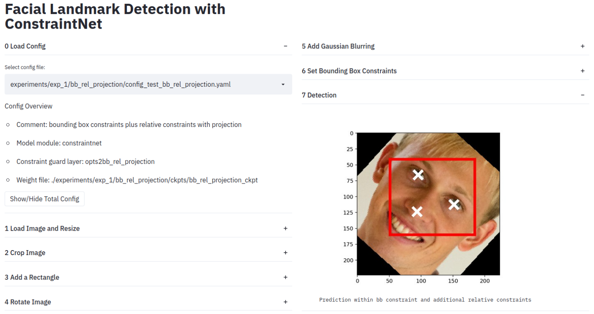
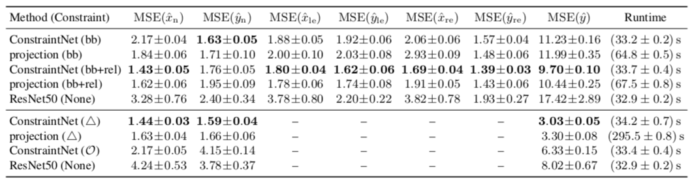

# ConstraintNet: Output constraints on a facial landmark detection

This repository implements the facial landmark detection tasks in the paper "Sample-Specific Output Constraints for Neural Networks". Three neural networks are implemented: ResNet50 (without constraints) [2], ConstraintNet (with constraints), and a projection-based approach (with constraints) [3,4,5]. The backbone of ConstraintNet and of the projection-based approach is ResNet50 [2]. For a fair comparison, we constucted the projection-based approach analogously to ConstraintNet and replaced the constraint guard layer with a layer which performs a projection on the constrained output space. For the projection layer, we use the packages cvxpy and cvxpylayers [3,4,5]. To get a quick overview about the experiments and output constraints, we recommend to play around with the interactive streamlit app (see section Streamlit app). The app allows to load the config file of the experiment, to load an image, to adjust the preprocessing steps, and to set the output constraints. For the configured settings, a live detection is performed. 


## Requirements
Make sure you have installed Cuda (tested with Cuda 10.1).
To create a conda environment with all required dependencies use the provided *environment.yml* file and run:

```setup
conda env create -f environment.yml
```

To activate the conda environment  run:
```setup
conda activate facial_lm_pred
```


## Configuration files and option definition files

For reproducibility
of the experiments, we provide option defintion files and configuration files. 
The option definition file defines options and the configuration file sets the 
options. The option defintion and configuration files for the experiments are located in subdirectories of the *./experiments*
directory. The *./experiments* directory has subdirectories *exp_1* and *exp_2* for 
the corresponding experiments in the paper. The first experiment (*exp_1*) considers the
landmark detection of the nose, the lefteye and the righteye with ResNet50 
(subdirectory *exp_1/resnet*), with the projection-based approach (subdirectory *exp_1/bb_projection* for bounding box 
constraints and subdirectory *exp_1/bb_rel_projection* for bounding box constraints with additional
relations between the landmarks), and with ConstraintNet (subdirectory *exp_1/bb* for bounding box 
constraints and subdirectory *exp_1/bb_rel* for bounding box constraints with additional
relations between the landmarks). The second experiment (*exp_2*) is a nose landmark detection task and experiments are performed with ResNet50 (subdirectory *exp_2/resnet*), with the projection-based approach (subdirectory *exp_2/triangle_projection* for triangle constraints), and ConstraintNet
(subdirectory *exp_2/triangle* for triangle constraints and subdirectory *exp_2/sectors of
a circle* for sector of a circle constraints). For each experiment, the option definition and the configuration file are
provided for training and test, separately.

## Streamlit app



To start the streamlit app activate the conda environment *facial_lm_pred* and
run:
```setup
streamlit run streamlit_app.py
```
The app allows to load a config file and an image, to adjust the preprocessing steps
(cropping, adding a rectangle, rotating, Gaussian blurring), and to set the output constraints.
For the configured settings, a live detection is performed. You can load images
from the directory *pics/*.


## CelebA dataset

We perform all experiments on CelebA [1] dataset. For saving computational
ressources, we rescaled the images and adapted the landmark annotations
(*list_landmarks_celeba.txt*) appropriately before applying training and test. We rescaled
the shorter edge of each image to a length of 300px with bilinear interpolation and
saved
the images in an seperate folder. Furthermore, we adopted the *list_landmark_celeba.txt* file accordingly. For running the experiments, set the option `img_dir` to the path of the directory with the rescaled images and 
`lms_file` to the path of the file with adopted landmark annotations. The options can be set in the configuration file or via command line parameters.

Via command line parameters:
```
--imgs_dir <path to directory with images>              
--lms_file <path to file with landmark annotations>
```

Via configuration file:
```
imgs_dir: <path to directory with images>
lms_file: <path to file with landmark annotations>
```

## Pre-trained models
We provide pre-trained models for all experiments.
The pre-trained models are located in the *ckpts* subdirectory of the
corresponding experiment folder. The weights can be loaded for evaluation via
specifying the path to the weight file in the `--reload_ckpt_file` option (see
evaluation). E.g. the weight file for ConstraintNet bounding box constraints can be located via
`--reload_ckpt_file ./experiments/exp_1/bb/ckpts/bb_ckpt`.

## Training

For training, run `python train.py` from root directory and specify
the option definition and configuration file via the command line parameters
`--opt_def` and `--config`. E.g. for running the facial landmark detection with
ConstraintNet and bounding box constraints, call:

`python train.py --opt_def
./experiments/exp_1/bb/opt_def_train_bb.yaml --config
./experiments/exp_1/bb/config_train_bb.yaml --imgs_dir <path to image directory> --lms_file <path
to landmarks file>.`


## Evaluation

For evaluation on test set, run `python test.py` from root directory and specify
the option definition, the configuration file and the learned weights via 
the command line parameters `--opt_def`, `--config` and `--reload_ckpt_file`. 
E.g. for the evaluation for nose landmark detection with ConstraintNet and bounding box 
constraints, call:

`python test.py --opt_def ./experiments/exp_1/bb/opt_def_test_bb.yaml
--config ./experiments/exp_1/bb/config_test_bb.yaml --reload_ckpt_file
./experiments/exp_1/bb/ckpts/bb_ckpt --imgs_dir <path to rescaled image directory> --lms_file <path
to adopted landmarks file>.`

## Results

The table shows the mean squared error (MSE) for facial landmark detection with
ConstraintNet, the projection-based approach, and ResNet50 on test set of CelebA dataset. Results are shown
for constraints in form of bounding boxes (bb), additional constraints to
enforce a relative arrangement of the landmarks (bb+rel), triangle (triangle
symbol) and sector of a circle constraints (calligraphic O). The average value and the standard deviation are determined over 30
test runs are shown. 



[1] Ziwei Liu, Ping Luo, Xiaogang Wang, Xiaoou Tang. Deep learning face
attributes in the wild. In Proceedings of the IEEE International Conference on
Computer Vision. 2015

[2] Kaiming He, Xiangyu Zhang, Shaoqing Ren, Jian Sun. Deep Residual Learning
for Image Recognition. Proceedings of the IEEE Computer Society Conference on Computer Vision and Pattern Recognition. arxiv: https://arxiv.org/pdf/1512.03385.pdf

[3] Steven Diamond and Stephen Boyd. CVXPY: A Python-embedded modeling language for convex optimization. Journal of Machine Learning Research. 2016

[4] Akshay Agrawal, Robin Verschueren, Steven Diamond, Steven Boyd. A rewriting
system for convex optimization problems. Journal of Control and Decision. 2018

[5] Agrawal, A. and Amos, B. and Barratt, S. and Boyd, S. and Diamond, S. and
Kolter, Z.. Differentiable Convex Optimization Layers. Advances in Neural
Information Processing Systems. 2019
